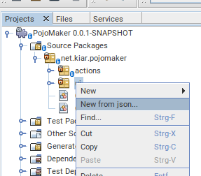

Netbeans PojoMaker Plugin
=========================

# Introduction

This plugin is a small integrated interface of [jsonschema2pojo](https://www.jsonschema2pojo.org/) which generates simple 
Java classes from Json schema or much simpler raw Json snippets. 

After installation of the nbm file you can find the plugin in action in the context menu of each project source tree node (_New from json..._)

# Changelog

- 0.4.4
    - add tooltip text in UI to give more help
    - add 'use Optionals for Getters' and 'add Constructors' options for generator in UI
    - ensure NB 14 compatibility
- 0.4.3
    - set a class name prefix
    - type of source (schema, json, yaml)
    - more generator options
    - fix exception is thrown during package name extraction under windows
- 0.3.3 version release in central maven repository and available in Netbeans Plugins
- 0.1.0 first version

# Developement

## release

Follow the instruction given at [sonatype](https://central.sonatype.org/publish/publish-maven/) 
and prepare your gpg key. For a release type

    mvn clean deploy

## How to Contribute

Just submit a PR! :)

## License

This software is licensed under the [Apache 2.0 License](LICENSE).
